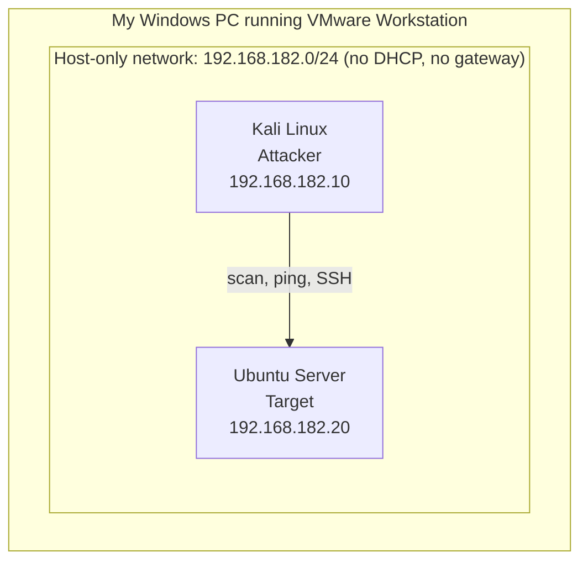
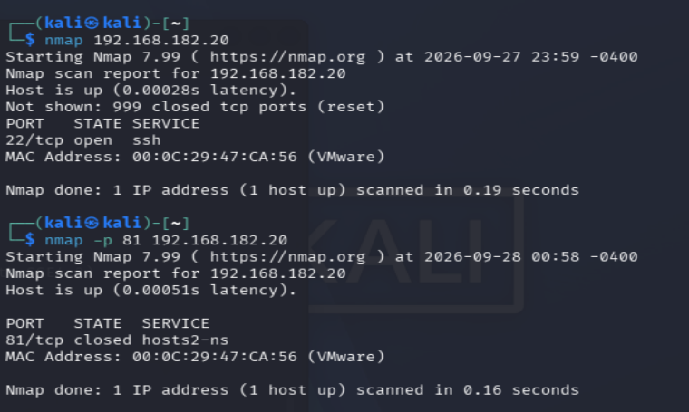
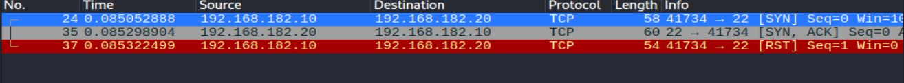
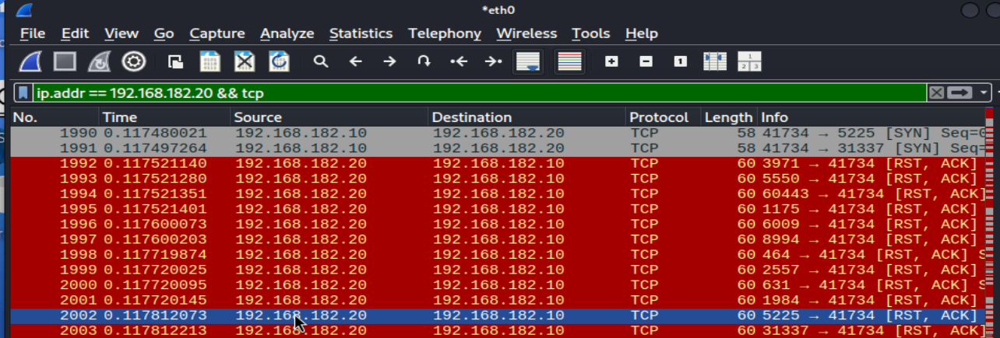
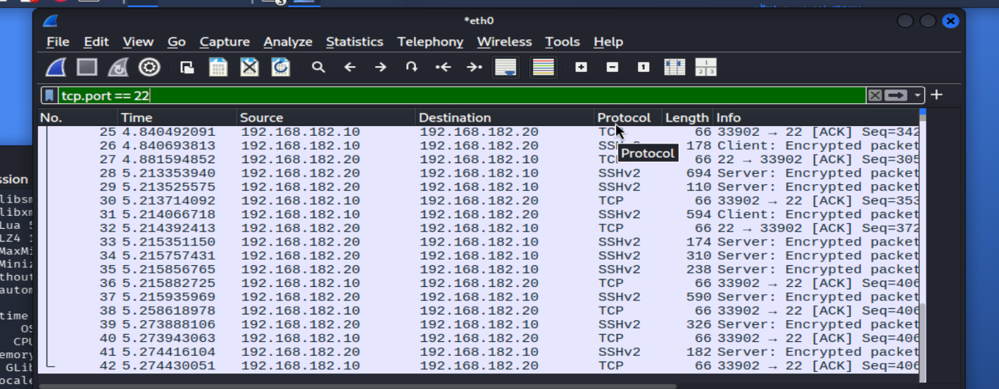

# My Cybersecurity Homelab

I built this small lab to learn security from both sides of the table. On one side, I attack a target machine from Kali Linux. On the other, I put on the defender's hat and look at what that attack left behind in the network traffic and system logs.

Everything here runs inside VMware on my own PC, on a private network that can't reach the internet or my home network. I only scan and attack machines I built myself.

---

## What I wanted to get out of this

- A safe place to practice without touching anything real
- To see what an attack looks like from the attacker's side (Kali, Nmap)
- To see what that same attack looks like to a defender (Wireshark, system logs)
- To finally understand networking basics by actually using them: static IPs, subnets, ports, ICMP, TCP, and SSH

---

## How it's set up



Two virtual machines sit on their own little network. Kali is the attacker, Ubuntu is the target, and they can only talk to each other.

### Hardware

| AbesaelPC | Hypervisor | [8 core CPU/ 32GB RAM] | [3tb SSD] |home LAN| The physical machine everything runs on |
| kali | Attacker | [2 core / 5GB RAM] | [40 GB] | 192.168.182.10 (`eth0`) | Virtual machine |
| ubuntu-server | Target | [2 core / 4GB RAM] | 40 GB (single file) | 192.168.182.20 (`ens33`) | Virtual machine |

### Software

| VMware Workstation | 25H2 | My PC | Runs the virtual machines | Manual install |
| Kali Linux | [2026.3] | kali | Attacking and testing | Installed from ISO |
| Ubuntu Server LTS | [26.04.1] | ubuntu-server | The target machine | Installed from ISO |
| OpenSSH Server | [10.2p1] | ubuntu-server | Remote login on port 22 | Picked during the Ubuntu install |
| Nmap | [7.99] | kali | Port scanning | Comes with Kali |
| Wireshark | [4.6.6.] | kali | Capturing and reading network traffic | Comes with Kali |

### Network

| Home LAN | IPv4 | router IP | Automatic (router) | My real PC and internet access |
| Homelab (VMware host-only) | 192.168.182.0/24 | None | Off, static IPs only | The isolated lab. Kali and Ubuntu can only reach each other. |

A few notes on the lab network:

- The mask is `255.255.255.0` (/24), so there are 254 usable addresses, `.1` through `.254`
- The network address is `192.168.182.0` and the broadcast address is `192.168.182.255`
- There are no VLANs, switches, or wireless access points since it's all virtual
- Havent set up a DNS server, so I reach machines by IP address
- The only way in is SSH (port 22) from Kali to Ubuntu

**Setting the static IPs**

Since DHCP is off, nothing hands out addresses, so I set them by hand. On Kali:

```bash
nmcli connection show #to show the name of my wired connection
sudo nmcli connection modify "Wired connection 1" ipv4.method manual ipv4.addresses 192.168.182.10/24 #to configurate
   #restart connection
sudo nmcli connection down "Wired connection 1"
sudo nmcli connection up "wired connection 1"
   #establishing the connection
ip addr
ip route
```
# BUILDING UBUNTU SERVER
I installed the ubuntu LTS server from the Ubuntu web. My plan was to use this server as the target server, but first i wanted to learn what was actually happening on the server by pinging ip, arp, nmap, and wireshark
**Setting the static IPs**
```bash
ls /etc/netplan/ #showed list of files inside folder /etc/netplan/
sudo cat /etc/netplan/00-installer-config.yaml #to open file
sudo nano /etc/netplan/00-installer-config.yaml #to edit file and establish connection
sudo netplan try #To test
ip addr show ens33
ip route
```
On Ubuntu before touching the file, I made a backup, just incase i made any errors:

```bash
sudo cp /etc/netplan/00-installer-config.yaml /etc/netplan/00-installer-config.yaml.backup
```
on kali
```bash
ping -c 4 192.168.182.20 #to make sure everything is configured correctly. Look for replies from UBUNTU
```
---

## What I did in the lab

### 1. Can the two machines see each other?

```bash
ping -c 4 192.168.182.20
ip neigh
```

`ping` sends a tiny ICMP message to Ubuntu and waits for a reply. If it answers, the network works. `ip neigh` then shows the list of neighbors Kali has recently talked to, along with their MAC addresses.

### 2. Predict first, then scan

Before scanning anything, I made a prediction. I installed OpenSSH Server on Ubuntu, so I expected it to be listening on **TCP port 22**. SInce thats the defualt port for ssh connection

To check from the inside, I ran this on Ubuntu:

```bash
sudo ss -tulpn #shows a list of ports that are open and listening from my machine 
```

To check from the outside, I ran this from Kali:

```bash
nmap 192.168.182.20 #basic nmap scan
nmap -sV 192.168.182.20 # a service/version detection scan to see if ssh is available
nmap -p 1-1000 192.168.182.20 #checks tcp ports 1-1000
nmap -p- 192.168.182.20 #checks all tcp ports
```

The main thing I learned is that the first two commands answer slightly different questions. `ss` tells me what's really running on the inside of the machine. Nmap tells me what an attacker can actually reach from the network. If those two ever disagree, something like a firewall is probably in the way.

### 3. Watching the scan in Wireshark

I captured the scan on wireshark to help me better see whats happening using this filter:

```
ip.addr == 192.168.182.20 && tcp
```

At first it was a wall of red rows, which looked alarming. It turned out to be completely normal. Here's how I read it:

| Packet | What it means |
|---|---|
| `SYN` from Kali | "Can I connect to this port?" |
| `RST, ACK` from Ubuntu | "Nothing's here, port closed." This is the flood of red. |
| `SYN, ACK` from Ubuntu | "Yes, I'm listening." This is what port 22 sent back. |
| `RST` from Kali | Nmap hangs up before finishing, which is why it's called a SYN or "half-open" scan |

A burst of SYNs to lots of different ports, followed by lots of resets, is what a port scan looks like on the wire. It's exactly the kind of pattern a SIEM would alert on.





### 4. Logging in over SSH, from both sides

First I started a Wireshark capture on Kali with the filter `tcp.port == 22`, then connected:

```bash
ssh <username>@192.168.182.20
```

This time Wireshark showed the full connection: the TCP handshake, the SSH setup, and then a stream of encrypted packets. I could tell that a login happened, but I couldn't read anything that was typed. That told me that SSH was doing its job.


Then I switched to Ubuntu to see the same login from the defender's side:

```bash
sudo journalctl -u ssh --since "10 minutes ago" #shows the log entries that the ssh server wrote in the last 10minutes
```

The Trail Failed attempts


The log showed a line like `Accepted password for <user> from 192.168.182.10`. If someone were guessing passwords, I'd expect to see a pile of `Failed password` lines instead.


---

## Things that went wrong (and how I fixed them)

**WHEN Setting the static IPs**

| What happened | Why | Fix |
|---|---|---|
| `ip addr` showed no IPv4 address and `ip route` was empty | DHCP was off on the host-only network, so nothing gave Kali an address | Set a static IP with `nmcli` |
| Error: `'manuel' not among [auto, link-local, manual, ...]` | I misspelled `manual` | Spelled it correctly |
| Error about `' ipv4'` not being allowed | A typo (`connectio`) plus a broken line break | Retyped the whole command on one line |
| "Wired connection 1 is not an active connection" | The connection was already down | Not a real problem, just bring it up with `nmcli connection up` |

Most of my early problems were typos. Lesson learned: read the error message closely, because it usually tells you exactly what's wrong.

---

## What I picked up along the way

- Subnetting, static IPs, and how network and broadcast addresses work
- What a virtual NIC is and how host-only networks work in VMware
- How ICMP, the TCP handshake, and ports fit together
- What a SYN scan looks like in a packet capture
- Why encrypted protocols like SSH hide the contents but not the fact that a connection happened
- How to read system logs to spot login activity

---

## What I want to do next

- [ ] Install a SIEM like Wazuh and send Ubuntu's logs to it
- [ ] Add a deliberately vulnerable web app like DVWA to practice on
- [ ] Harden Ubuntu (turn on a firewall, switch SSH to key-based login), then scan it again to see what changed
- [ ] Write alerts for port scans and repeated failed SSH logins

---

## Disclaimer

This is a learning project. Only scan or attack systems you own or have permission to test.
